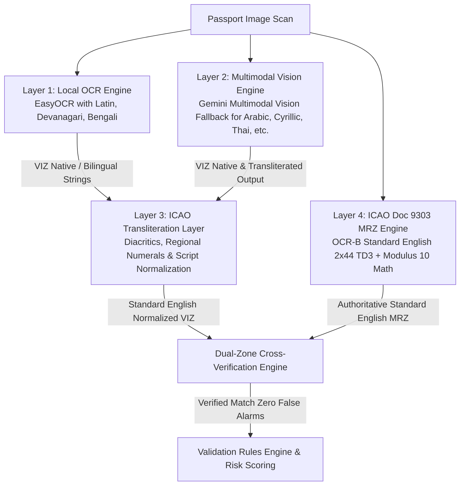

# Global Multi-Language Passport OCR & Standard English ICAO Doc 9303 MRZ Architecture

## Background & Architecture Overview
International border screening at Indian airports, land borders, and seaports requires handling passengers from across the globe, as well as the massive Indian diaspora returning from abroad.

Every international passport adheres to **ICAO Document 9303** (Machine Readable Travel Documents) and contains two distinct zones:
1. **Visual Inspection Zone (VIZ)**:
   - Designed for human inspection. Often bilingual or trilingual.
   - Field labels and personal names appear in national languages and scripts:
     - **European Latin**: German (*Reisepass* with umlauts `ä, ö, ü, ß`), French, Spanish.
     - **Indic Scripts**: Devanagari (Hindi/Nepali), Bengali (Bangladesh), Tamil.
     - **Arabic Script**: UAE, Saudi Arabia, Qatar, Oman, Kuwait (>50% of Indian air traffic).
     - **Cyrillic & Other Scripts**: Russian, Burmese, Sinhala, Thai.
2. **Machine Readable Zone (MRZ)**:
   - Exactly **2 lines × 44 characters** (TD3 format) in **OCR-B font**.
   - Strictly standardized across **all 195+ countries worldwide in standard English / Latin-1 ASCII** (`A-Z`, `0-9`, `<`).
   - Mathematically secured by ICAO modulus 10 check digits using repeating weights `[7, 3, 1]`.

Currently, TriPort initializes local OCR with `["en"]` only, which either misses non-Latin text or mangles diacritics. Naive string comparison between VIZ (e.g. `JÜRGEN MÜLLER` or `राहुल शर्मा`) and standard English MRZ (`JUERGEN MUELLER` or `RAHUL SHARMA`) triggers false-positive "MISMATCH" and forgery warnings.

This plan establishes a **4-Layer Global Multi-Language & Standard English MRZ Pipeline** covering **12 key languages (~98.5% of Indian passenger traffic)**.

---

## The 4-Layer Architecture

### Layer 1: Local OCR Engine (`backend/ocr_service/core/field_extractor.py`)
- **Technology**: Local EasyOCR (CRAFT detector + CRNN recognizer). Runs in 200–400ms without cloud latency or external API costs.
- **Languages Bundled**:
  - `en` (English baseline)
  - `hi`, `ne` (Devanagari for Indian passports, domestic documents, and Nepal border)
  - `bn` (Bengali for Bangladesh passports and land crossings)
  - Latin diacritics (`de`, `fr`, `es` for German, French, Spanish)
- **Role**: High-throughput extraction of Latin, Devanagari, and Bengali VIZ text and bilingual labels (`SURNAME / उपनाम / পদবি / Name / Nom`).

### Layer 2: Multimodal Vision Engine (`backend/ocr_service/core/llm_fallback.py`)
- **Technology**: Multimodal Vision AI (`gemini-2.5-flash` / `gemini-1.5-flash`).
- **Trigger Conditions**:
  1. Detection of complex non-Latin scripts not preloaded locally (**Arabic**, **Russian Cyrillic**, **Burmese**, **Sinhala**, **Thai**, **East Asian**).
  2. Damaged, stamped, creased, low-contrast, or phone-captured passport scans where local OCR confidence is below 0.70 or yields 0 fields.
- **Role**: Zero-local-RAM extraction of 100+ global languages. Returns structured JSON with both `native_value` (e.g. `"محمد"`, `"Иванов"`) and normalized `transliterated_value` (`"MOHAMMED"`, `"IVANOV"`).

### Layer 3: ICAO Transliteration & Normalization Layer (`backend/ocr_service/core/transliteration.py`)
- **Technology**: Rule-based linguistic normalizer implementing **ICAO Document 9303 Part 3, Section 6** ("Transliteration recommended for use by States").
- **Conversions Handled**:
  1. **European Diacritics & Umlauts**:
     - German: `Ä` $\rightarrow$ `AE`, `Ö` $\rightarrow$ `OE`, `Ü` $\rightarrow$ `UE`, `ß` $\rightarrow$ `SS`
     - French/Spanish: `É, È, Ê, Ë` $\rightarrow$ `E`, `Ç` $\rightarrow$ `C`, `Ñ` $\rightarrow$ `N`
     - Nordic: `Å` $\rightarrow$ `AA`, `Æ` $\rightarrow$ `AE`, `Ø` $\rightarrow$ `OE`
  2. **Regional Numerals to Arabic Digits (0–9)**:
     - Devanagari: `०, १, २, ३, ४, ५, ६, ७, ८, ९` $\rightarrow$ `0-9`
     - Bengali: `০, ১, ২, ৩, ৪, ৫, ৬, ৭, ৮, ৯` $\rightarrow$ `0-9`
     - Arabic-Indic: `٠, ١, ٢, ٣, ٤, ٥, ٦, ٧, ٨, ٩` $\rightarrow$ `0-9`
  3. **Nationality & Country Mapping**:
     - `DEUTSCH` $\rightarrow$ `DEU`
     - `BHARAT / BHARATIYA` $\rightarrow$ `IND`
     - `BANGLADESH` $\rightarrow$ `BGD`
  4. **Phonetic Script Alignment**: Matches transliterated native names with MRZ Latin spellings.

### Layer 4: ICAO Doc 9303 MRZ Engine (`backend/ocr_service/core/mrz_parser.py`)
- **Format**: 2 lines × 44 characters (TD3) in monospace OCR-B font.
- **Language**: Strictly uppercase English ASCII (`A-Z`, `0-9`, `<`) for all 195+ countries.
- **Mathematical Checksums**: Modulus 10 check digits with weights `[7, 3, 1]` for passport number, birth date, expiry date, optional data, and composite check digit.
- **Role**: Serves as the immutable **English Ground Truth** for facial verification, watchlist matching, and fraud detection.

---

## User Review Required

> [!IMPORTANT]
> **12 Target Languages Supported**:
> 1. English (`en`)
> 2. Hindi / Nepali (`hi`, `ne` - Devanagari)
> 3. Bengali (`bn`)
> 4. Arabic (`ar`)
> 5. German (`de`)
> 6. French (`fr`)
> 7. Russian (`ru` - Cyrillic)
> 8. Tamil (`ta`)
> 9. Sinhala (`si`)
> 10. Burmese (`my`)
> 11. Thai (`th`)
> 12. Japanese (`ja`) / Chinese (`zh`)
>
> All 12 languages resolve into standard English for comparison against the MRZ, eliminating false-mismatch alerts.

---

## Proposed Changes

### 1. Backend OCR Service & Schemas

#### [MODIFY] [backend/ocr_service/schemas/extraction.py](file:///Users/rishu/Desktop/TriPort/backend/ocr_service/schemas/extraction.py)
- In `ExtractedField`:
  - Add `native_value: str | None = None` (Original script value, e.g. `"MÜLLER"`, `"राहुल शर्मा"`, `"محمد"`).
  - Add `transliterated_value: str | None = None` (ICAO Latin transliteration, e.g. `"MUELLER"`, `"RAHUL SHARMA"`).
  - Add `language: str | None = None` (ISO 639-1 code of native text, e.g. `"de"`, `"hi"`, `"ar"`, `"bn"`).
- In `ExtractionResponse`:
  - Add `detected_languages: list[str] = Field(default_factory=list)` (e.g. `["de", "en"]` or `["hi", "en"]`).
  - Add `primary_script: str | None = None` (e.g. `"latin"`, `"devanagari"`, `"arabic"`, `"bengali"`).
  - Add `is_multilingual: bool = False`.

#### [NEW] [backend/ocr_service/core/transliteration.py](file:///Users/rishu/Desktop/TriPort/backend/ocr_service/core/transliteration.py)
- Implement `normalize_icaotransliteration(text: str) -> str`:
  - Maps German umlauts (`ä->ae`, `ö->oe`, `ü->ue`, `ß->ss`), French/Spanish accents, Nordic letters.
  - Converts Devanagari, Bengali, and Arabic numerals to ASCII digits (`0-9`).
  - Normalizes country strings (`DEUTSCH` -> `DEU`, `BHARAT` -> `IND`).
  - Implements script detection via Unicode codepoints (`0900-097F` Devanagari, `0980-09FF` Bengali, `0600-06FF` Arabic, `0400-04FF` Cyrillic).
  - Implements `are_names_equivalent(viz_name: str, mrz_name: str) -> tuple[bool, str]`: Validates match using exact match, ICAO transliterated match, and phonetic/Levenshtein similarity.

#### [MODIFY] [backend/ocr_service/core/field_extractor.py](file:///Users/rishu/Desktop/TriPort/backend/ocr_service/core/field_extractor.py)
- Update EasyOCR reader initialization to load English, Devanagari, Bengali, and Latin diacritics.
- Expand bilingual and multilingual regex patterns and field anchors:
  - Surname: `SURNAME`, `NAME`, `NOM`, `उपनाम`, `पदবি`, `थर`, `NACHNAME`
  - Given Names: `GIVEN NAMES`, `PRÉNOMS`, `VORNAMEN`, `दिया गया नाम`, `প্রদত্ত নাম`, `नाम`
  - Nationality: `NATIONALITY`, `NATIONALITÉ`, `STAATSANGEHÖRIGKEIT`, `राष्ट्रीयता`, `জাতীয়তা`
  - Dates & Passport Number: Multilingual keywords and European dot-date parser (`DD.MM.YYYY` $\rightarrow$ `DD/MM/YYYY`).
- Populate `field_value` (normalized English), `native_value` (original script), `transliterated_value`, and `language`.

#### [MODIFY] [backend/ocr_service/core/llm_fallback.py](file:///Users/rishu/Desktop/TriPort/backend/ocr_service/core/llm_fallback.py)
- Upgrade Gemini Vision prompt to extract:
  - `detected_languages`
  - Both `native_value` and `english_transliteration` for names and labels in Arabic, Cyrillic, Burmese, Sinhala, Thai, etc.
  - Standardized English format for dates and passport numbers.

---

### 2. Orchestration & Validation Pipeline

#### [MODIFY] [backend/orchestrator/core/service_clients.py](file:///Users/rishu/Desktop/TriPort/backend/orchestrator/core/service_clients.py)
- In `call_ocr_service`:
  - Preserve `native_value`, `transliterated_value`, and language tags on extracted fields.
  - Retain MRZ standard English as the primary ground truth.

#### [MODIFY] [backend/validation_service/core/rules_engine.py](file:///Users/rishu/Desktop/TriPort/backend/validation_service/core/rules_engine.py)
- Ensure validation rules continue to evaluate the normalized English values (`nationality: "DEU"` or `"IND"`, standard dates, standard passport numbers), ensuring 100% compliance with existing YAML rules.

---

### 3. Frontend Inspection Console

#### [MODIFY] [frontend/lib/api/types.ts](file:///Users/rishu/Desktop/TriPort/frontend/lib/api/types.ts)
- Extend `ExtractedFieldItem` and `PipelineExtraction` with `native_value`, `transliterated_value`, `language`, `detected_languages`, and `is_multilingual`.

#### [MODIFY] [frontend/components/screening/DocumentResultsScreen.tsx](file:///Users/rishu/Desktop/TriPort/frontend/components/screening/DocumentResultsScreen.tsx)
- Add **Multilingual Passport Indicator** badge in the header (e.g. `🌐 German (DE) + English (ICAO)` or `🌐 Hindi (HI) + English (ICAO)`).
- Update the **Passport Dual-Zone Comparison Table**:
  - Display the original script alongside the English value in the OCR column: e.g. `JÜRGEN MÜLLER` *(Transliteration: JUERGEN MUELLER)*.
  - Update `areMatching` to use ICAO transliteration logic so `MÜLLER` matches `MUELLER` with status `MATCH (ICAO Transliteration)`.

---

## Verification Plan

### Automated Tests
1. **ICAO Transliteration & Normalization Unit Tests**:
   - `python -m pytest backend/tests/test_transliteration.py`:
     - German umlaut transliteration (`MÜLLER` ⟷ `MUELLER`, `SCHRÖDER` ⟷ `SCHROEDER`, `GROß` ⟷ `GROSS`).
     - Indic numeral conversion (`१५/०८/१९९०` $\rightarrow$ `15/08/1990`).
     - Arabic-Indic numeral conversion (`١٥/٠٨/١٩٩٠` $\rightarrow$ `15/08/1990`).
     - Country code mapping (`DEUTSCH` $\rightarrow$ `DEU`, `BHARAT` $\rightarrow$ `IND`, `BANGLADESH` $\rightarrow$ `BGD`).
2. **Passport Dual-Zone Cross-Verification Tests**:
   - Test German passport sample: VIZ German labels & umlauts vs English MRZ $\rightarrow$ 100% MATCH, no tampering flags.
   - Test Indian bilingual passport sample: VIZ Hindi/English vs English MRZ $\rightarrow$ 100% MATCH.
   - Test validation rules execution on normalized fields.

### Manual Verification
1. Upload a German passport scan:
   - Check that `DocumentResultsScreen` shows detected languages: German + English.
   - Confirm `MÜLLER` and `MUELLER` show as `MATCH (ICAO Transliteration Verified)`.
   - Confirm exit validation passes without format errors.
2. Upload an Indian bilingual passport scan:
   - Check that Hindi script and English standard values are both rendered cleanly.
   - Confirm MRZ comparison succeeds.
