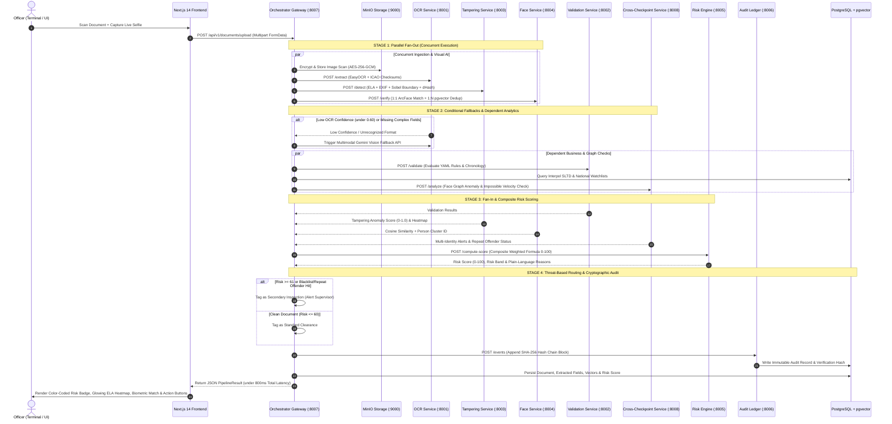
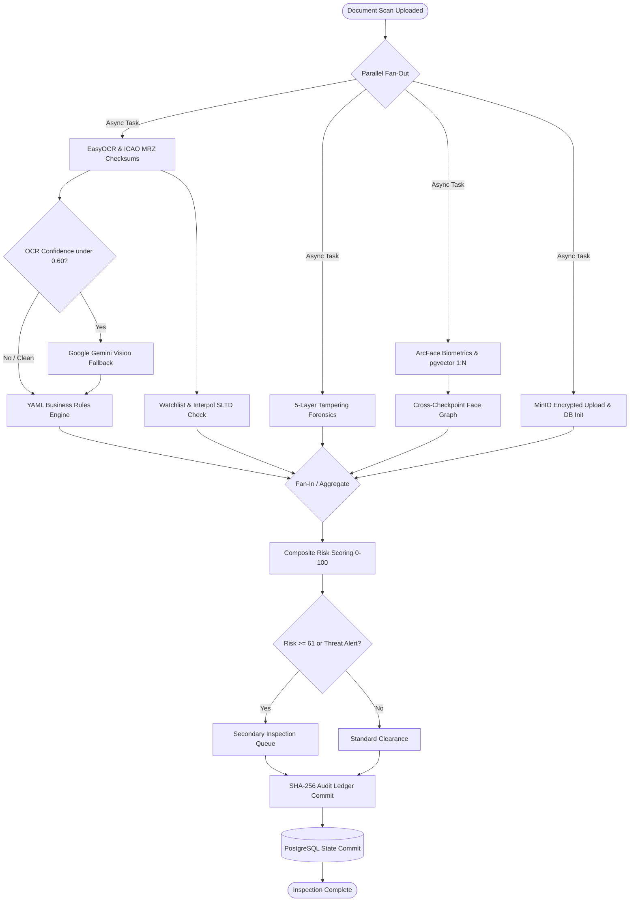

<div align="center">

# 🛡️ BorderGuard-AI (TriPort)
### *Next-Generation AI Fake Identity & Multi-Modal Document Screening System*
**Airports ✈️ • Land Borders 🚗 • Passenger Seaports 🚢**

[](https://fastapi.tiangolo.com)
[](https://langchain-ai.github.io/langgraph/)
[](https://pytorch.org)
[](https://ai.google.dev)
[](https://github.com/deepinsight/insightface)
[](https://github.com/pgvector/pgvector)
[](https://cryptography.io)
[](backend/tests/)
[](LICENSE)

<p align="center">
  <b>Sub-second parallelized document extraction, 5-layer forensic tampering detection (ELA), ArcFace 1:1/1:N biometric deduplication, cross-checkpoint impossible-velocity multi-identity graphs, LangGraph state orchestration with automated Secondary Inspection routing, and SHA-256 cryptographic audit ledgers.</b>
</p>

---

[Key Highlights](#-key-highlights) • [System Architecture](#-system-architecture) • [End-to-End Data Flow](#-end-to-end-screening-architecture--data-flow) • [LangGraph Screening DAG](#-langgraph-orchestration-dag) • [Core Microservices](#-core-microservices) • [Testing & Verification](#-test-suite--verification) • [Quick Start](#-quick-start)

---

</div>

## 📌 Problem & Solution

Border checkpoints process thousands of documents daily across **Airports, Land Border Gates, and Passenger Sea Ports**. Manual physical inspection struggles against modern fraudulent methods:

* 🎭 **Digital Tampering & Splicing**: Photoshopped dates, forged visas, and photo-swaps on genuine passport booklets.
* 👥 **Syndicate Multi-Identity Fraud**: The same individual presenting different names and passport numbers across separate checkpoints.
* ⚡ **High Queue Pressures**: Officers have a strict **5 to 8 second inspection window** per traveler.
* 📶 **Low-Connectivity Outposts**: Remote land borders lack reliable cloud access and require edge offline inference with sync.
* ⚖️ **Legal & Evidentiary Gaps**: Inability to mathematically prove tampering or audit officer clearance records in court.

**BorderGuard-AI** solves this with a **LangGraph-orchestrated microservices architecture** that screens travelers in **<800ms**, detects multi-identity anomalies across checkpoints, and immutably records all events into a **SHA-256 cryptographic hash-chained audit ledger**.

---

## ✨ Key Highlights

- ⚡ **Sub-Second Parallel DAG**: Initial ML workloads (**MinIO + OCR + 5-Layer Tampering + ArcFace Biometrics**) execute concurrently in parallel fan-out, cutting screening latency by **>60%**.
- 🔍 **5-Layer Forensic Tampering Engine**:
  - **Error Level Analysis (ELA)** recompression delta heatmaps.
  - **EXIF Metadata & Software Signature Analysis**.
  - **Photo Boundary Discontinuity & Noise Variance (Sobel)**.
  - **Entry/Exit Stamp Perceptual Hash (dHash) Matching**.
  - **Typography & Stroke-Width Consistency Analysis**.
- 👤 **State-of-the-Art Biometrics**:
  - **ArcFace 512-dimensional facial embeddings** (Cosine distance < 0.40).
  - **MediaPipe EAR anti-spoofing liveness verification**.
  - **1:N PostgreSQL `pgvector` biometric deduplication & cluster tracking**.
- 🌐 **Cross-Checkpoint Face Graph Engine**:
  - Detects conflicting names and swapped document numbers across crossings.
  - **Impossible Travel Velocity Detection**: Flags sightings across different checkpoints within < 2 hours.
  - **Repeat Offender Auto-Escalation**: Automatically escalates risk tiers by +1 band if prior critical incidents exist.
- 🔀 **Conditional Routing & Secondary Inspection**:
  - **Conditional Node 1 (OCR Quality)**: Low-confidence scans dynamically route to **Google Gemini Vision Multimodal Fallback**.
  - **Conditional Node 2 (Threat Level)**: Scans with Risk >= 61, blacklist hits, or repeat offender alerts are automatically routed to the **Secondary Inspection Queue**.
- 🔒 **Cryptographic SHA-256 Audit Ledger**:
  - Tamper-evident sequential hash chaining (`Block[N] = SHA256(Payload[N] || PrevHash || Timestamp)`).
  - Mathematical proof of zero retroactive mutations via `verify_chain()`.
  - Field-level **AES-256-GCM** encryption for PII and document scans at rest.
- 📡 **Edge Inference & Offline Sync**:
  - Standalone **ONNX Runtime** edge model runner for resource-constrained posts.
  - Local **SQLite WAL buffer** with automatic background reconciliation to central PostgreSQL.


---

## 🏗 System Architecture

```
                                  ┌────────────────────────────────────────────────────────┐
                                  │               Next.js 14 Officer Interface             │
                                  │      (Live Camera Feed • Document Scanner • Alerts)    │
                                  └───────────────────────────┬────────────────────────────┘
                                                              │ REST / Multipart Upload
                                                              ▼
                                  ┌────────────────────────────────────────────────────────┐
                                  │           ⚡ Orchestrator Gateway (FastAPI :8007)       │
                                  │       (LangGraph StateGraph DAG • Auth • Routing)      │
                                  └─────┬──────────────┬──────────────┬──────────────┬─────┘
                                        │              │              │              │
              ┌─────────────────────────┼──────────────┼──────────────┼──────────────┴────────────────────────┐
              ▼                         ▼              ▼              ▼                                       ▼
  ┌───────────────────────┐ ┌──────────────────────┐ ┌──────────────────────┐ ┌────────────────────────┐ ┌────────────────────────┐
  │      OCR Service      │ │  Tampering Service   │ │     Face Service     │ │   Validation Service   │ │Cross-Checkpoint Service│
  │     (Port :8001)      │ │     (Port :8003)     │ │     (Port :8004)     │ │      (Port :8002)      │ │      (Port :8008)      │
  │ • EasyOCR Extraction  │ │ • Error Level (ELA)  │ │ • ArcFace 512d Vector│ │ • YAML Rules Engine  │ │ • Face Graph Analytics │
  │ • ICAO MRZ Checksums  │ │ • EXIF Metadata      │ │ • EAR Blink Liveness │ │ • Regional Rules (5) │ │ • Impossible Velocity  │
  │ • Gemini Vision Model │ │ • Sobel Boundary     │ │ • 1:N pgvector Dedup │ │ • SLTD Watchlist DB  │ │ • Repeat Offender Band │
  │ • Batch Queue         │ │ • Stamp dHash Match  │ │ • Cluster Assignment │ │ • Offline Cache      │ │ • Central Dossier API  │
  └───────────┬───────────┘ └──────────┬───────────┘ └──────────┬───────────┘ └───────────┬────────────┘ └───────────┬────────────┘
              │                        │                        │                         │                          │
              └────────────────────────┴───────────────┬────────┴─────────────────────────┴──────────────────────────┘
                                                       ▼
                                  ┌────────────────────────────────────────────────────────┐
                                  │           🧠 Explainable Risk Engine (Port :8005)      │
                                  │  (Dynamic Composite Scoring 0-100 • Plain-Text Reasons) │
                                  └───────────────────────────┬────────────────────────────┘
                                                              │
                                                              ▼
                                  ┌────────────────────────────────────────────────────────┐
                                  │           🔗 SHA-256 Audit Ledger (Port :8006)         │
                                  │    (Tamper-Evident Hash Chaining • Zero Mutation Proof)│
                                  └───────────────────────────┬────────────────────────────┘
                                                              │
                                  ┌───────────────────────────┴────────────────────────────┐
                                  ▼                                                        ▼
                    ┌───────────────────────────┐                            ┌───────────────────────────┐
                    │   PostgreSQL + pgvector   │                            │    MinIO Object Storage   │
                    │(Docs, Embeddings, Ledger) │                            │(AES-256 Encrypted Blobs)  │
                    └───────────────────────────┘                            └───────────────────────────┘
```

---

## 🔄 End-to-End Screening Architecture & Data Flow



---

### 🔎 Step-by-Step Data Journey

| Phase | Component | Action & Data Transformation |
| :--- | :--- | :--- |
| **1. Input Ingestion** | **Next.js 14 UI** | Captures document scan via flatbed optical scanner or file upload + live passenger webcam photo. Submits `multipart/form-data` payload containing `document_file`, `live_photo`, and `checkpoint_type`. |
| **2. Parallel Fan-Out** | **Orchestrator (:8007)** | Spawns concurrent asynchronous workers in **LangGraph**: saves encrypted image to MinIO (`:9000`), invokes OCR (`:8001`), runs forensic tampering detection (`:8003`), and extracts ArcFace embeddings (`:8004`). |
| **3. Forensic Tampering** | **`tampering_service` (:8003)** | Performs 5-layer anomaly analysis: Error Level Analysis (ELA) compression differentials, EXIF structure validation, Sobel photo boundary discontinuity, and entry/exit stamp dHash matching. |
| **4. Biometrics & Dedup** | **`face_service` (:8004)** | Compares live selfie against document photo (512-d ArcFace vector). Checks MediaPipe blink/motion anti-spoof liveness. Searches `pgvector` index to detect if this face has been seen under other identities (`person_cluster_id`). |
| **5. OCR & Fallback** | **`ocr_service` (:8001)** | Extracts visual zone fields and validates ICAO 9303 MRZ check digits (`[7,3,1]` algorithm). If OCR confidence is < 0.60, automatically triggers **Google Gemini Multimodal Vision API**. |
| **6. Business & Graph Rules** | **`validation_service` (:8002) & `cross_checkpoint` (:8008)** | Validates 6-month passport validity rules, issuing dates, and regional formats (Nepal, Bangladesh, Bhutan, Myanmar, India). Cross-checks face cluster history for **conflicting alias names**, **passport number swapping**, and **impossible travel velocity** (< 2h transit across borders). |
| **7. Risk Engine Synthesis** | **`risk_engine` (:8005)** | Weighs all subscores into a composite metric (0 to 100). Classifies the risk band (`Low`, `Medium`, `High`, `Critical`), escalates risk tier by +1 for repeat offenders, and generates itemized plain-language officer explanations. |
| **8. Threat Routing** | **LangGraph Router** | Scans with Risk >= 61, Blacklist hits, or Repeat Offender alerts route to the **Secondary Inspection Queue**. Clean scans route to **Standard Clearance**. |
| **9. Audit Ledger Commit** | **`audit_ledger` (:8006)** | Computes SHA-256 of the event payload and cryptographically binds it to the previous ledger block (`Block[N] = SHA256(Payload[N] || PrevHash || Timestamp)`) before committing to PostgreSQL. |
| **10. Officer Review** | **Officer Terminal UI** | Receives the full `PipelineResult` in **< 800ms**. Renders visual inspection checklist, glowing ELA heatmap overlay, biometric match gauge, and action triggers (`Approve`, `Secondary Inspection`, `Detain`). |

---

## ⚡ LangGraph Orchestration DAG

The document screening workflow is modeled as a **LangGraph StateGraph**:



---

## 📦 Core Microservices

| Service | Port | Primary Responsibilities | Core Tech Stack |
| :--- | :---: | :--- | :--- |
| **`orchestrator`** | `8007` | LangGraph DAG pipeline coordination, RBAC auth, and Secondary Queue routing | `LangGraph`, `FastAPI`, `SQLAlchemy`, `asyncpg` |
| **`ocr_service`** | `8001` | ResNet document classifier, EasyOCR, ICAO 9303 MRZ parser, Gemini Vision fallback | `EasyOCR`, `google-generativeai`, `Pillow`, `PyTorch` |
| **`validation_service`** | `8002` | YAML business rules (6 doc types), regional rules (5 nations), Interpol SLTD | `PyYAML`, `pydantic`, `SQLAlchemy` |
| **`tampering_service`** | `8003` | Error Level Analysis (ELA), EXIF metadata, Sobel boundary noise, stamp dHash | `opencv-python`, `scikit-image`, `numpy` |
| **`face_service`** | `8004` | 1:1 facial verification, MediaPipe EAR liveness, pgvector 1:N deduplication | `InsightFace` (ArcFace), `DeepFace`, `MediaPipe`, `pgvector` |
| **`cross_checkpoint_service`**| `8008` | Face cluster intelligence, name mismatch, impossible travel velocity (< 2h) | `FastAPI`, `networkx`, `pydantic` |
| **`risk_engine`** | `8005` | Dynamic weighted composite risk scoring (0 to 100) & plain-language reasons | `pydantic`, `FastAPI` |
| **`audit_ledger`** | `8006` | Append-only SHA-256 hash chaining, AES-256-GCM encryption, integrity CLI | `cryptography`, `hashlib`, `SQLAlchemy` |
| **`edge_inference`** | *local* | Standalone CPU-optimized ONNX runtime engine for low-connectivity outposts | `onnxruntime`, `numpy`, `Pillow` |

---

## 🎯 Explainable Risk Engine (0–100)

Composite risk is computed from dynamic sub-scores and categorized into four operational bands:

```
Risk Score = (w_val × S_val) + (w_tamper × S_tamper) + (w_face × S_face) + (w_blacklist × S_blacklist) + (w_cross_checkpoint × S_cross_checkpoint)
```

| Risk Tier | Score Range | Operational Action |
| :--- | :---: | :--- |
| 🟢 **LOW** | `0.0 – 30.0` | **Standard Clearance**: Automated gate passage. |
| 🟡 **MEDIUM** | `31.0 – 60.0` | **Officer Review**: Check near-expiry document or regional permit requirements. |
| 🟠 **HIGH** | `61.0 – 80.0` | **Secondary Inspection**: Routed to supervisor for forensic physical examination. |
| 🔴 **CRITICAL** | `81.0 – 100.0` | **Immediate Intercept**: Watchlist hit, ICAO checksum failure, photo splice, or repeat offender. |


---

## 🧪 Test Suite & Verification

The backend includes a comprehensive test suite of **196 automated unit and integration tests** covering all 7 phases:

```bash
cd backend
.venv/bin/pytest tests/ -v
```

```
================================================================================
TOTAL BACKEND TESTS: 196 PASSED | 0 FAILED | 0 ERRORS in 65.29s (100%)
================================================================================
✓ Phase 1 & 2: OCR classification, EasyOCR, MRZ parsing & batch queues (46 tests)
✓ Phase 3: YAML rules, regional rules & SLTD database checks (38 tests)
✓ Phase 4: ELA heatmaps, EXIF metadata, boundary Sobel & stamp dHash (37 tests)
✓ Phase 5: ArcFace embeddings, 1:1 match, EAR liveness & pgvector dedup (36 tests)
✓ Phase 6: Face graph, name mismatch, impossible travel & repeat offenders (15 tests)
✓ Phase 7: LangGraph StateGraph, conditional routing, SHA-256 audit ledger (12 tests)
✓ API Integration & End-to-End Chains (12 tests)
```

---

## 🚀 Quick Start

### 1. Prerequisites
- **Python 3.11**
- **Docker & Docker Compose** (for PostgreSQL + pgvector and MinIO)
- **Node.js 18+** (for Frontend)

### 2. Installation & Setup
```bash
# Clone the repository
git clone https://github.com/Rishu7011/BorderGuard-AI.git
cd BorderGuard-AI

# Create Python 3.11 virtual environment
uv venv --python 3.11 backend/.venv
source backend/.venv/bin/activate

# Install all backend dependencies
uv pip install -r backend/requirements-core.txt -r backend/requirements-ml.txt
```

### 3. Environment Configuration
```bash
cp .env.example .env
# Edit .env and configure your keys (e.g. LLM_API_KEY for Gemini fallback)
```

### 4. Start Core Infrastructure (Docker)
```bash
docker-compose up -d postgres minio
```

### 5. Launch Backend Services
You can run services individually for development or all via Docker:

```bash
# Start Cross-Checkpoint Service
backend/.venv/bin/uvicorn backend.cross_checkpoint_service.main:app --port 8008 --reload

# Start Orchestrator Gateway
backend/.venv/bin/uvicorn backend.orchestrator.main:app --port 8007 --reload
```

Interactive OpenAPI Swagger UI is available at:
- **Orchestrator**: `http://localhost:8007/docs`
- **Cross-Checkpoint Service**: `http://localhost:8008/docs`
- **Face Service**: `http://localhost:8004/docs`
- **Tampering Service**: `http://localhost:8003/docs`
- **Validation Service**: `http://localhost:8002/docs`
- **OCR Service**: `http://localhost:8001/docs`

### 6. Verify Cryptographic Ledger Integrity
Run the standalone ledger verification CLI to test mathematical hash chain integrity:
```bash
# Validate live chain
python scripts/verify_ledger_integrity.py

# Simulate a database corruption attack and confirm detection
python scripts/verify_ledger_integrity.py --corrupt-test
```

---

## 🔒 Security & Privacy Architecture

- **Zero-Trust Encryption**: Field-level **AES-256-GCM** encryption on sensitive PII and MinIO image blobs.
- **Strict Role-Based Access Control (RBAC)**: Distinct permissions for `officer`, `supervisor`, and `auditor` with JWT tokens.
- **Threat Model Document**: Detailed trust boundaries, attack vectors, and mitigations documented in [`docs/threat-model.md`](docs/threat-model.md).

---

## 📄 License

Distributed under the **MIT License**. See `LICENSE` for details.
